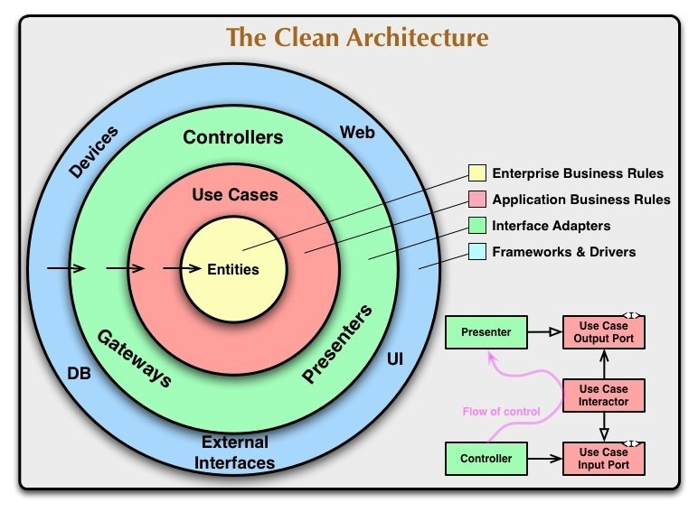
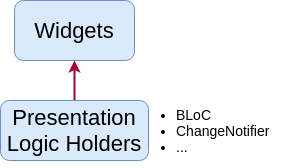
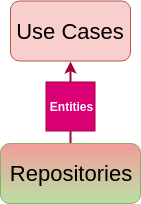
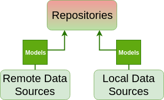

# Defensor

This project is make in Flutter(Dart language) under the architecture **Clean Architecture**.

>It's architecture based on the book and blog by Uncle Bob. It is a combination of concepts taken from the Onion Architecture and other architectures. The main focus of the architecture is separation of concerns and scalability. It consists of four main modules: core, data, domain, and presentation.
>

## Architecture diagram
</br>


## Project Organization

### Presentation

This is the stuff you're used to from "unclean" Flutter architecture. You obviously need widgets to display something on the screen. These widgets then dispatch events to the Bloc and listen for states (or an equivalent if you don't use Bloc for state management).



> Note that the "Presentation Logic Holder" (e.g. Bloc or Provider) doesn't do much by itself. It delegates all its work to use cases. At most, the presentation layer handles basic input conversion and validation.

### Domain

Domain is the inner layer which shouldn't be susceptible to the whims of changing data sources or porting our app to Angular Dart. It will contain only the core business logic (use cases) and business objects (entities). It should be totally independent of every other layer.

> Use Cases are classes which encapsulate all the business logic of a particular use case of the app (e.g. LoginUserUseCase or GetCurrentUserUseCase).

But... How is the domain layer completely independent when it gets data from a Repository, which is from the data layer?  Do you see that fancy colorful gradient for the Repository? That signifies that it belongs to both layers at the same time. We can accomplish this with dependency inversion.



That's just a fancy way of saying that we create an abstract Repository class defining a contract of what the Repository must do - this goes into the domain layer. We then depend on the Repository "contract" defined in domain, knowing that the actual implementation of the Repository in the data layer will fullfill this contract.

> Dependency inversion principle is the last of the SOLID principles. It basically states that the boundaries between layers should be handled with interfaces (abstract classes in Dart).

### Data

The data layer consists of a Repository implementation (the contract comes from the domain layer) and data sources - one is usually for getting remote (API) data and the other for caching that data. Repository is where you decide if you return fresh or cached data, when to cache it and so on.

You may notice that data sources don't return Entities but rather Models. The reason behind this is that transforming raw data (e.g JSON) into Dart objects requires some JSON conversion code. We don't want this JSON-specific code inside the domain Entities - what if we decide to switch to XML?



Therefore, we create Model classes which extend Entities and add some specific functionality (toJson, fromJson) or additional fields, like database ID, for example.

The RemoteDataSource will perform HTTP GET requests on the API. LocalDataSource will simply cache data using the shared_preferences package.
</br>

# Getting Started

## Config environment variables 
    - `.env.dev` for development
    - `.env.prod` for production

        - `BASE_API_URL` base api url.
        - `PUBLIC_API_TOKEN` public api token for open endpoints.
        - `GOOGLE_PLACES_API_KEY` google places api key.

## Generate string bundle language

    `flutter pub run gen_lang:generate`

## Run command

    - debug dev `flutter run -t lib/main_dev.dart --flavor=dev` 
    
    - release dev `flutter run -t lib/main_dev.dart --release --flavor=dev` 

    - debug prod `flutter run -t lib/main_prod.dart --flavor=prod` 
    
    - release prod `flutter run -t lib/main_prod.dart --release --flavor=prod`

## Build command
    
    - Android
  
      - apk

        - dev `flutter build apk -t lib/main_dev.dart --flavor=dev`
        
        - prod `flutter build apk -t lib/main_prod.dart --flavor=prod`
    
      - appbundle

        - dev `flutter build appbundle --target-platform android-arm,android-arm64,android-x64 -t lib/main_dev.dart --flavor=dev`
       
        - prod `flutter build appbundle --target-platform android-arm,android-arm64,android-x64 -t lib/main_prod.dart --flavor=prod`
        
    - iOS

        - dev `flutter build ios -t lib/main_dev.dart --flavor=dev`
       
        - prod `flutter build ios -t lib/main_prod.dart --flavor=prod`

## Disable unused permissions on podfile ios **permission_handler**
  
    ```
    post_install do |installer|
        installer.pods_project.targets.each do |target|
            target.build_configurations.each do |config|
            config.build_settings['ENABLE_BITCODE'] = 'NO'
            # You can remove unused permissions here
            # e.g. when you don't need camera permission, just add 'PERMISSION_CAMERA=0'
            config.build_settings['GCC_PREPROCESSOR_DEFINITIONS'] ||= [
                '$(inherited)',

                ## dart: PermissionGroup.calendar
                'PERMISSION_EVENTS=0',

                ## dart: PermissionGroup.reminders
                'PERMISSION_REMINDERS=0',

                ## dart: PermissionGroup.contacts
                'PERMISSION_CONTACTS=0',

                ## dart: PermissionGroup.camera
                # 'PERMISSION_CAMERA=0',

                ## dart: PermissionGroup.microphone
                'PERMISSION_MICROPHONE=0',

                ## dart: PermissionGroup.speech
                'PERMISSION_SPEECH_RECOGNIZER=0',

                ## dart: PermissionGroup.photos
                # 'PERMISSION_PHOTOS=0',

                ## dart: [PermissionGroup.location, PermissionGroup.locationAlways, PermissionGroup.locationWhenInUse]
                # 'PERMISSION_LOCATION=0',
            
                ## dart: PermissionGroup.notification
                # 'PERMISSION_NOTIFICATIONS=0',

                ## dart: PermissionGroup.mediaLibrary
                'PERMISSION_MEDIA_LIBRARY=0',

                ## dart: PermissionGroup.sensors
                'PERMISSION_SENSORS=0'
            ]
            end
        end
    end
    ```